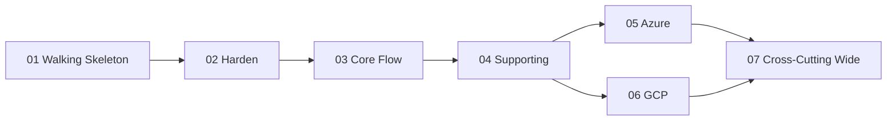

# TomSandboxWMS — Roadmap (Executable Multi-Session Plan)

> **Kelas:** B / time-bounded (`docs/working-docs/`). Sumber kebenaran arsitektur tetap **Kelas A**: `docs/adr/*` · `docs/architecture/*` · `docs/tomsandboxwms-overview.md` (project-rules.md Rule 1). Roadmap ini **mengurutkan implementasi**, bukan mendesain ulang — arsitektur sudah final (27 ADR).

## Ringkasan
Sandbox WMS microservices **.NET 8** untuk belajar **Enterprise Architecture + AZ-204 + GCP PCD**. 7 bounded context — 3 core (Inbound · Inventory · Outbound) + 4 supporting (MasterData · Auth · Reporting · Notification) — event-driven (Outbox/Inbox), **DB-per-service** (PostgreSQL), **gRPC** antar-service + **REST** untuk UI, **tri-cloud** (Local Aspire → Azure → GCP) via Hexagonal port + per-cloud adapter, compute **Mixed PaaS**.

**Arc:** walking skeleton → harden building blocks → lengkapi core flow → supporting services → Azure → GCP → cross-cutting wide.

## Konvensi & naming registry (anchor semua phase)
- **App** = `Wms`. Solution `Wms.sln` + filter `Wms.Local.slnf` / `Wms.Azure.slnf` / `Wms.Gcp.slnf`. `Directory.Build.props` (.NET 8 LTS, nullable, implicit usings) + `Directory.Packages.props` (CPM).
- **Project**: `Wms.BuildingBlocks.{Domain,Application,Infrastructure,Web}` · `Wms.Platform.{Hosting,Local,Azure,Gcp}` · `Wms.<Module>.{Domain,Application,Infrastructure,Api,Contracts,Grpc}` · `Wms.<Module>.Host.{Local,Azure,Gcp}` · `Wms.Gateway` · `Wms.WebUI` · `Wms.AppHost`.
- **Module** ∈ {Inbound, Inventory, Outbound, MasterData, Auth, Reporting, Notification}.
- **Integration event** (logical name `{module}.{event_snake}.v{N}`, POCO di `*.Contracts`): `inbound.gr_confirmed.v1` (`GRConfirmedV1`) · `outbound.wave_released.v1` (`WaveReleasedV1`) · `inventory.stock_allocated.v1` (`StockAllocatedV1`) · `outbound.shipment_dispatched.v1` (`ShipmentDispatchedV1`) · `outbound.picking_completed.v1` (`PickingCompletedV1`) — event ke-5 (di luar katalog 4 asli) yang **merealisasikan sinyal** overview §B (PickingTask Completed → Stock `Allocated→Picked`); **diputuskan di ADR-0028** (`docs/adr/0028-picking-completed-event.md`), daftarkan di `asyncapi.yaml`. **Event 6–7 (Inventory→Reporting, ADR-0030, Phase 04c):** `inventory.putaway_completed.v1` (`PutawayCompletedV1`) · `inventory.stock_removed.v1` (`StockRemovedV1`) — event-carried state transfer untuk read-side projection §F; enrichment non-breaking `gr_confirmed`(+`supplierId`)/`picking_completed`(+`operatorId`).
- **Ports** (BuildingBlocks, impl per-cloud): `IMessagePublisher` · `ISecretProvider` · `ICacheStore` · `IServiceTokenProvider` · `IDelayedTaskQueue`(+`IDelayedTaskHandler`) · `ITelemetryStream` · `IPasswordHasher` · `IObjectStore` · `IAuditLogStore` · `IDeadLetterStore` · `ICurrentUser`.
- **Fitness functions** (`tests/Wms.Architecture.Tests`): #1–#6 core (blueprint §4); #7 no-business-throw di `*.Domain` (grep→Roslyn); #8 `*.Api` gRPC tak sentuh `DbContext`; #9 no `Local*` adapter di cloud host; #10 no standalone `InfrastructureDbContext`; #11 contract-coverage vs `asyncapi.yaml`. **Behavioral** (test suite, bukan NetArchTest): split-timeout-configured · aggregate-emission · negative-security.

## Phase index
Status: `planned | in-progress | blocked | done`.

### Phase 01 — Walking Skeleton (LOCAL) · prinsip 1
| # | slug | judul | status | depends-on |
|---|---|---|---|---|
| 01a | solution-skeleton-fitness-functions | Solution `Wms` + BuildingBlocks seedwork + 6 FF + Aspire AppHost | done | — |
| 01b | outbox-inbox-messaging-rail | Outbox dispatcher + Inbox dedup + `IMessagePublisher`(Local) + envelope | done | 01a |
| 01c | inbound-inventory-event-chain | Thin slice E2E: GR → `GRConfirmed` → Stock + PutawayTask | done | 01b |

### Phase 02 — Harden Building Blocks (LOCAL) · prinsip 2
| # | slug | judul | status | depends-on |
|---|---|---|---|---|
| 02a | error-handling-mediatr-pipeline | `Result`→transport mapping + Validation/Transaction/Logging behavior + FF#7 | done | 01c |
| 02b | event-contract-catalog-ddd-conventions | AsyncAPI catalog + contract-coverage FF#11 + tactical DDD + emission FF + DeadLetter | done | 02a |
| 02c | audit-system-actor-observability-baseline | SYSTEM actor + out-of-band audit log + correlation-id + OTel baseline | done | 02b |

### Phase 03 — Complete Core Flow (LOCAL) · prinsip 3
| # | slug | judul | status | depends-on |
|---|---|---|---|---|
| 03a | inbound-goodsreceipt-discrepancy | `GoodsReceipt` full state machine + two-axis discrepancy + resolutions | done | 02c |
| 03b | inventory-stock-lifecycle-allocation | Stock lifecycle + PutawayTask + `WaveReleased`/`ShipmentDispatched` consumer + FEFO | done | 03a |
| 03c | outbound-wave-picking-dispatch | OutboundOrder + Wave + PickingTask + `StockAllocated` consumer; E2E s/d ShipmentDispatched | done | 03b |

### Phase 04 — Supporting Services (LOCAL) · prinsip 3
| # | slug | judul | status | depends-on |
|---|---|---|---|---|
| 04a | masterdata-read-api-cache-aside | Warehouse/Location/Product + gRPC read-API + `ICacheStore` cache-aside + snapshot wiring | done | 03c |
| 04b | auth-jwt-refresh-token-rotation | User/Role/Permission/RefreshToken + login JWT RS256 + Argon2id + rotation + read-API | done | 04a |
| 04c | reporting-projections | Pure consumer projection (Inbox-committed): StockOnHandView/ReceivingSummary/… | done | 03c |
| 04d | notification-async-delivery | Subscription + Delivery + async worker + idempotency + retry/DLQ + channel ports | done | 04b |
| 04e | webui-gateway | Blazor Server WebUI (thin) + Gateway (YARP local) wiring REST | done | 04c, 04d |

### Phase 05 — Azure / Mixed PaaS · prinsip 4
| # | slug | judul | status | depends-on |
|---|---|---|---|---|
| 05a | azure-foundation-adapters-iac | `Platform.Azure` adapters + Bicep shared infra + GitHub Actions OIDC | planned | 04e |
| 05b | azure-container-apps-core-services | Inbound/Inventory/Outbound/MasterData/Auth → ACA + KEDA + Service Bus | planned | 05a |
| 05c | azure-apim-appservice-webui | APIM gateway + App Service (WebUI always-on + session affinity) | planned | 05b |
| 05d | azure-functions-reporting-notification | Reporting/Notification → Azure Functions (isolated) + Service Bus trigger | planned | 05b |

### Phase 06 — GCP / Mixed PaaS · prinsip 4
| # | slug | judul | status | depends-on |
|---|---|---|---|---|
| 06a | gcp-foundation-adapters-iac | `Platform.Gcp` adapters + Terraform shared infra + Workload Identity Federation | planned | 04e |
| 06b | gcp-cloud-run-core-services | Inbound/Inventory/Outbound/MasterData/Auth → Cloud Run + Pub/Sub | planned | 06a |
| 06c | gcp-apigateway-cloudrun-webui | API Gateway/Apigee + Cloud Run WebUI (min-instances≥1 + affinity) | planned | 06b |
| 06d | gcp-cloud-functions-pubsub-push | Reporting → Cloud Functions gen2 (Eventarc); Notification → Cloud Run + Pub/Sub push | planned | 06b |

### Phase 07 — Cross-Cutting Wide (FINAL) · prinsip 5
| # | slug | judul | status | depends-on |
|---|---|---|---|---|
| 07a | authorization-wire-up | Grep `TODO-AUTH` → `[Authorize(Permission)]` + `IsActive` filter + authz test suite | planned | 05d, 06d |
| 07b | observability-distributed-tracing | W3C trace-context cross-broker + App Insights/Cloud Trace + `ITelemetryStream` | planned | 07a |
| 07c | resilience-delayed-tasks | Polly split-timeout calibration + `IDelayedTaskQueue` durable (quarantine-aging→`StockQuarantineStale`) | planned | 07a |
| 07d | security-hardening-managed-identity | Managed Identity / Workload Identity end-to-end + secret rotation + negative-security tests | planned | 07a |

## Dependency graph (milestone-level)
Sub-phase dalam satu milestone urut `a→b→c`. Phase 05 (Azure) & 06 (GCP) dua **track paralel** (sama-sama depend 04e); disarankan **Azure dulu** (AZ-204 retire 31 Jul 2026), lalu GCP.

## Coverage matrix #1 — AZ-204 (baris = milestone)
> X = exam objective ter-exercise. Baris **01–04 = pattern/SDK-agnostic skill**; baris **05 = branded Azure service**; **06 = GCP** (lihat matrix #2). Detail per sub-phase di field *Touchpoint cert* tiap phase doc.

| Phase | ACA | App Service | Functions | APIM | Blob | Redis | Service Bus | KeyVault/MI | Entra/JWT | AppInsights/OTel | Postgres | CICD/OIDC |
|---|---|---|---|---|---|---|---|---|---|---|---|---|
| 01 |  |  |  |  |  |  | X(p) |  |  | X(p) | X(p) |  |
| 02 |  |  |  |  |  |  |  |  |  | X(p) |  |  |
| 03 |  |  |  |  |  |  |  |  |  |  | X(p) |  |
| 04 |  |  |  |  |  | X(p) | X(p) |  | X(p) |  | X(p) |  |
| 05 | X | X | X | X | X | X | X | X | X | X | X | X |
| 06 |  |  |  |  |  |  |  |  |  |  |  |  |
| 07 |  |  |  |  |  |  |  | X | X | X |  | X |

## Coverage matrix #2 — GCP PCD (baris = milestone)
| Phase | Cloud Run | Functions gen2 | API GW/Apigee | Cloud Storage | Memorystore | Pub/Sub | Secret Mgr | Cloud SQL | Workload Id | Trace/Mon | Cloud Tasks | Build/AR/OIDC |
|---|---|---|---|---|---|---|---|---|---|---|---|---|
| 01 |  |  |  |  |  | X(p) |  | X(p) |  | X(p) |  |  |
| 02 |  |  |  |  |  |  |  |  |  | X(p) |  |  |
| 03 |  |  |  |  |  |  |  | X(p) |  |  |  |  |
| 04 |  |  |  |  | X(p) | X(p) |  | X(p) |  |  |  |  |
| 05 |  |  |  |  |  |  |  |  |  |  |  |  |
| 06 | X | X | X | X | X | X | X | X | X | X |  | X |
| 07 |  |  |  |  |  |  | X |  | X | X | X |  |

## Protokol multi-sesi
**Pilih phase berikutnya.** Di Phase index, ambil baris pertama `status=planned` yang **semua** `depends-on`-nya `done`. Cloud: 05* & 06* dua track paralel — Azure dulu, baru GCP.

**Bootstrap sesi baru.** Cukup baca: (1) phase doc target, (2) ADR/arsitektur di field *Context refs* phase itu, (3) section Protokol ini. **Tak perlu** baca seluruh roadmap atau phase lain.

**Verifikasi pre-conditions (sebelum ngoding).** Baca *Pre-conditions* → cek state repo (project/file/tabel yang diasumsikan ada) → smoke: `dotnet build Wms.sln`, `dotnet test tests/Wms.Architecture.Tests`, dan DoD command phase prasyarat. Ada yang merah/absen → STOP, prasyarat belum benar `done`.

**Update status saat selesai.** (1) `Status: done (YYYY-MM-DD)` di phase doc. (2) Ubah kolom status baris itu di Phase index. (3) Isi *Handoff notes* sesuai state akhir repo.

## Out-of-scope global (JANGAN diimplement di phase manapun)
Dari overview: **QC release flow** (Quarantine→OnHand) · **allocation failure** handling · **picking discrepancy** · **wave reschedule/cancel** · **return-to-vendor flow**. Kalau tersentuh, catat sebagai gap — jangan dibangun. (Event `StockLow`/`StockNearExpiry` = emitted-but-unconsumed gap ADR-0023; biarkan tak ber-consumer. `StockQuarantineStale` di-wire di 07c via `IDelayedTaskQueue`.)
